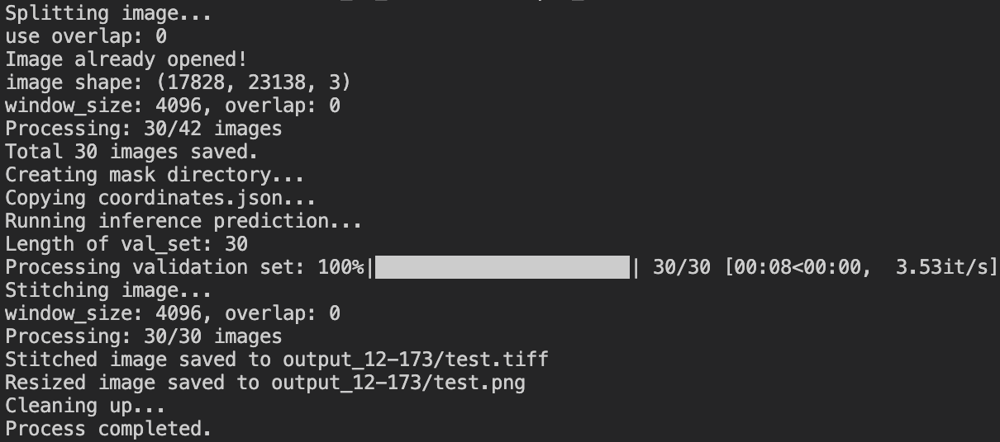
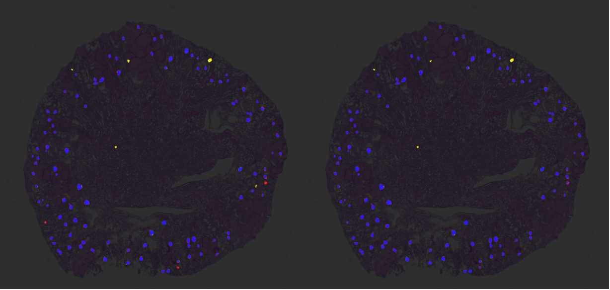

# KPI2024


MICCAI肾小球


## Third-party requirement

```
segmentation-models-pytorch==0.3.3
torch
wandb
tqdm
```

## How to Train

train_ddp_dice.py

```bash
cd train

torchrun --nproc_per_node=4 --nnodes=1 train_ddp_dice.py --encoder-name timm-regnety_016 --batch-size 6 --save-path regnet016Upp.pth --gpu-id 0,1,2,3,4 --model-type UnetPlusPlus --world-size 4
```

Inference Task2, bash instruction

```bash
cd inference
bash task2_infer.sh /home/cvailab/nnUNet/Task2/val/normal/normal_M1_wsi.tiff  test.tiff
```

The output will be similar to the following, and the results will be written to a .txt file. Additionally, a 2048x2048 thumbnail of the WSI segmentation will be saved as a visualized result.






Inference Task1, bash instruction

```bash
#python task1_patch_infer.py source_folder  output_folder
python task1_patch_infer.py  data/Task1/val  predict_patch
```

## visualization


